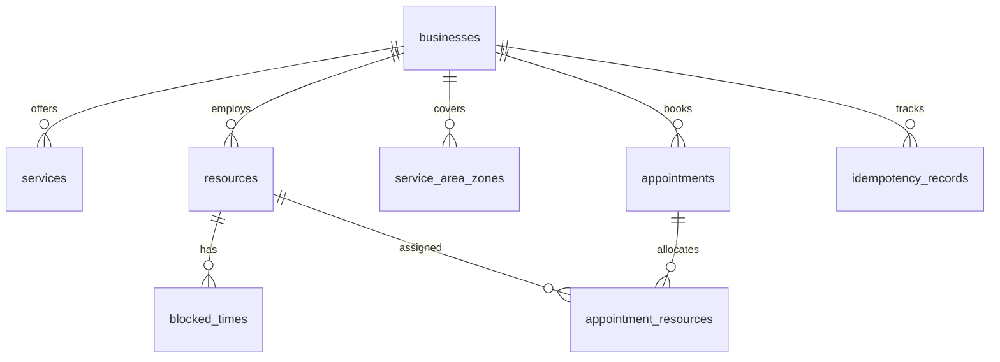

# Persistence Layer & Database Schema

Protocol Tooling uses **PostgreSQL** for relational consistency, index scans, and JSONB document storage.

---

## Entity-Relationship Diagram

---

## Primary Tables

* **`businesses`**: Root tenant records with `working_hours_json` and `address_json`.
* **`services`**: Bookable offerings with `resource_requirements_json` and `keywords_json`.
* **`resources`**: Human staff and physical equipment/rooms with `capabilities` and individual shift schedules.
* **`service_area_zones`**: Postal code arrays associated with service zones.
* **`appointments`**: Confirmed and cancelled bookings with customer JSON and price snapshots.
* **`appointment_resources`**: Relational join recording exact resource IDs assigned to an appointment.
* **`blocked_times`**: Planned downtime, holidays, or staff breaks.
* **`idempotency_records`**: Hash records for request deduplication.
