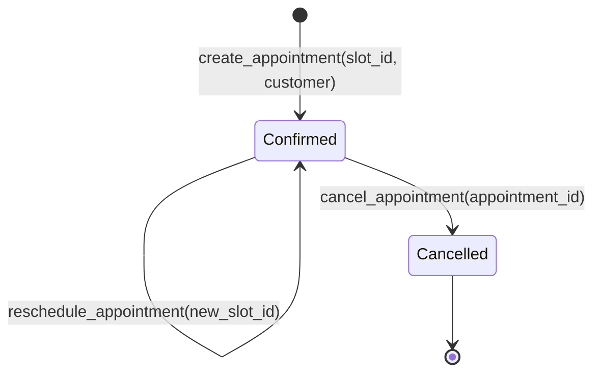

# Appointments and Lifecycle

An `Appointment` represents a confirmed scheduling commitment between a customer and a business.

---

## The Appointment State Machine

### 1. Creation (`create_appointment`)
* Requires a valid, unexpired `slot_id`.
* Checks service-area eligibility if `service_area_required` is true.
* Evaluates `Idempotency-Key` or `idempotency_key` parameter. If a booking with the same idempotency scope already exists, returns the original booking without duplicating resource allocations.
* Atomically persists the `Appointment` and associated `appointment_resources` records in PostgreSQL.

### 2. Retrieval (`get_appointment`)
* Returns full appointment state, customer details, assigned resources, and timestamps.
* Used by agents to verify status before initiating rescheduling or cancellations.

### 3. Rescheduling (`reschedule_appointment`)
* Requires the original `appointment_id` and a newly computed `new_slot_id`.
* The appointment must be in `confirmed` status (cannot reschedule a `cancelled` appointment).
* Releases original resource time allocations and locks the new slot time in a single transaction.

### 4. Cancellation (`cancel_appointment`)
* Marks the status as `cancelled`.
* Frees all allocated resources immediately so the time slots become available for other customers.
* Re-cancelling an already cancelled appointment returns structured domain error `APPOINTMENT_ALREADY_CANCELLED`.
