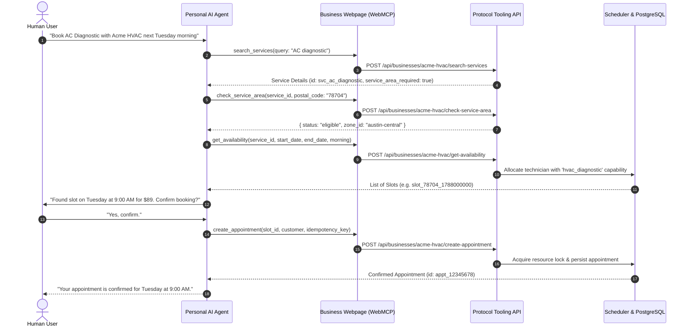

# Overview

**Protocol Tooling** is open-source infrastructure designed from the ground up for **agentic scheduling**. It bridges the gap between client-side AI assistants (browser agents, conversational LLMs) and service-business booking backends.

Instead of forcing users through multi-step form funnels or requiring third-party plugins with shared database access, Protocol Tooling exposes standard browser capabilities via **WebMCP** (`document.modelContext`) backed by an authoritative, transactional scheduling engine.

---

## Why Agent-Native Scheduling?

Conventional online scheduling systems were built for human visual interfaces:

1. **Brittle scraping**: Browsers and AI agents struggle with dynamic JavaScript calendar pickers, date pickers, and multi-page wizard forms.
2. **Hidden domain constraints**: Field service businesses require postal code service-area verification; clinics require matching therapist capabilities with available treatment rooms. Agents cannot guess these rules.
3. **Double-booking risks**: Agents operating asynchronously need cryptographic or tokenized slot reservations with strict idempotency to prevent racing conditions and stale bookings.

Protocol Tooling solves this by providing:

* **Direct WebMCP Registration**: The business website automatically registers standard scheduling tools on the user's browser context.
* **Deterministic Slot Generation**: Availability slots carry unique, short-lived tokens (`slot_id`) that encode required multi-resource allocations.
* **Authoritative Server Validation**: All mutations (booking, rescheduling, cancelling) enforce ACID transactions and idempotency keys in PostgreSQL.

---

## High-Level Workflow

---

## Next Steps

* Follow the [Quickstart](/getting-started/quickstart) to register WebMCP tools on a sample page in 5 minutes.
* Learn how to run the backend in [Local Development](/getting-started/local-development).
* Read about [Agent-Native Scheduling Concepts](/concepts/agent-native-scheduling).
